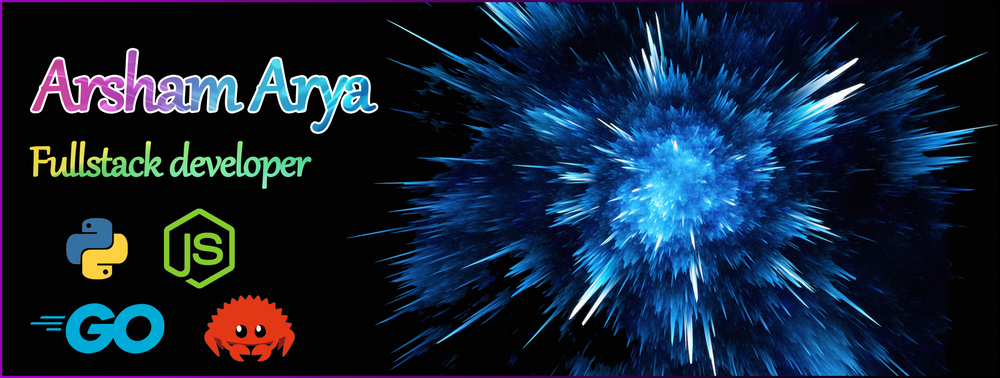

# Hey there, I'm  Arsham Arya.

<!-- HEADER -->
[](https://github.com/arshamalh)

## Let's connect! 
<div align="center">
<p align="center"></p>
<a href="https://www.twitter.com/arshamalh/">
    
</a>
	
<a href="https://www.linkedin.com/in/arshamalh/">
    
</a>

<a href="https://medium.com/@arshamalh">
    
</a>

<a href="https://stackoverflow.com/users/12972198/arsham">
    
</a>

<a href="mailto:arshamalh@gmail.com">
    
</a>

<a href="https://github.com/arshamalh/arshamalh/raw/main/arshamAryaResume.pdf">
	
</a>
</div>

## Info
```go
whoAmI := map[string]interface{}{
	"name":            "Arsham",
	"profession":      "Fullstack Developer",
	"location":        "Iran",
	"languages":       []string{"Javascript", "Python", "Go", "Rust", "Solidity"},
	"databases":       []string{"PostgreSQL", "MongoDB", "Redis", "MySQL"},
	"frameworks":      []string{"ExpressJS", "FastAPI", "Gin", "Socket.io", "NextJS"}
	"interests":       []string{"Blockchain", "Web development", "Cloud", "IoT"},
	"design":          []string{"Microservices", "Eventdriven development"},
	"tools":           []string{"Docker", "Git"},
	"systems":         []string{"MacOS", "Linux", "Windows"},
}
``` 

## Statistics

<p align = "center">
  
  

</p>

<p align = "center">
  
</p>


<p align = "center">
 
</p> 
